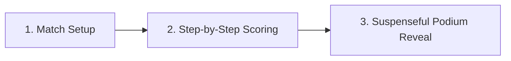

# 🔴 Terraforming Mars — Tabletop Score Calculator (PWA)

[](https://vitejs.dev/)
[](https://react.dev/)
[](https://www.typescriptlang.org/)
[](https://tailwindcss.com/)
[](https://web.dev/progressive-web-apps/)
[](https://opensource.org/licenses/MIT)

An elegant, mobile-first Progressive Web App (PWA) designed to eliminate tabletop notepad clutter, manual math errors, and end-of-game calculation fatigue after epic 3-hour sessions of **Terraforming Mars**.

---

## 🚀 Mission & Overview

After hours of intense engine-building, converting heat, laying oceans, and drafting project cards, tallying final scores on paper pads is prone to human error, missed adjacencies, and tedious arithmetic.

**Terraforming Mars Score Calculator** streamlines the entire endgame scoring ritual into an intuitive, phone-friendly, step-by-step walkthrough. Designed to be passed around the table or operated by a designated scorekeeper, it keeps final scores veiled until a dramatic podium reveal, preserving tension until the very end.

---

## 📱 3-Screen Tabletop Guided Walkthrough

The application replaces overwhelming single-screen spreadsheets with a focused 3-screen guided flow:



### 1. Minimal Match Setup
- **Player Scaling (1–5 Players)**: Instant selector dynamically configures player rows.
- **Player Profiles**: Customize names, select from 36 official corporations (Base, Prelude, Venus Next, Colonies, Turmoil), and pick distinctive player token colors (Red, Blue, Green, Yellow, Charcoal, Purple, Orange).
- **Map Board Selection**: Choose between **Tharsis (Standard)**, **Hellas**, and **Elysium**, auto-populating official Milestone & Award rosters.
- **Expansion Modules**: Toggle **Venus Next** (adds Hoverlord milestone and Venuphile award) and **Turmoil** (adds Chairman & Party Leader VP).

### 2. Guided Step-by-Step Category Flow
Scores are entered one category at a time to prevent cognitive overload:
1. **Final TR**: Starting Terraform Rating baseline.
2. **Milestones & Awards**: Global trackers enforcing game limits and official tie rules.
3. **Board Tiles**: Owned greenery tiles and city adjacency greenery bonuses.
4. **Cards VP & Turmoil**: Fixed and variable victory points from played cards + Turmoil governance points + final M€ cash for tiebreaking.

> **Tabletop-Optimized In-App Keypad:**
> Tapping any input opens an in-app numeric keypad drawer with `+1`, `+5`, and direct digit inputs. This completely prevents the mobile OS virtual keyboard from popping up and jarringly shifting viewport scroll positions.

### 3. Suspenseful Post-Game Podium Reveal
- **Veiled Scores**: Running totals remain completely hidden until all categories are recorded.
- **Dramatic Champion Spotlight**: Celebratory podium presentation (1st, 2nd, 3rd) with animated canvas confetti.
- **Co-Winner & Tiebreaker Alerts**: Clear breakdown showing MegaCredits (M€) tiebreaker resolution.
- **Ranked Leaderboard**: Clean summary of player rankings and total Victory Points.
- **Expandable Point Breakdown**: Inspect the comprehensive scoring matrix across all categories for full transparency.
- **1-Click Match Report**: Copy a formatted Markdown match summary directly to the clipboard for Discord, WhatsApp, or Slack.

---

## ⚖️ Official Rule Scoring Coverage

- **Terraform Rating (TR)**: 1 VP per 1 TR.
- **Milestones**: 5 VP per milestone claimed (strictly enforces the global limit of 3 claimed milestones per match).
- **Awards (Strict Official Rules)**:
  - 1st Place = 5 VP, 2nd Place = 2 VP.
  - **2-Player Rule**: 2nd place receives 0 VP in 2-player games.
  - **1st Place Tie**: Tied players both receive 5 VP; 2nd place award is cancelled (0 VP).
  - **2nd Place Tie**: Tied players both receive 2 VP.
- **Greeneries**: 1 VP per owned greenery tile.
- **City Adjacency**: 1 VP per adjacent greenery tile (regardless of owner) per owned city.
- **Cards VP**: Direct entry of positive and negative points from played Project Cards.
- **Turmoil Expansion**: +1 VP for Chairman, +1 VP per Party Leader seat held.
- **Tiebreaker**: Most MegaCredits (M€ cash on hand) breaks ties; exact ties result in shared victory.

---

## 📶 PWA & Offline Support

Play anywhere — whether in a remote cabin, game cafe basement, or crowded convention hall:

- **Zero-Network Operation**: Service worker precaches all application assets, JavaScript, styles, and web fonts. Once loaded, the app runs completely offline.
- **Installable on iOS**: Add to Home Screen via Safari for a fullscreen, standalone native-app experience without browser URL bars.
- **Installable on Android & Chromium**: Native PWA install prompts supported with crisp maskable PNG icons (192×192 and 512×512).

---

## 🛠️ Tech Stack

- **Framework**: [React](https://react.dev/) (v19)
- **Language**: [TypeScript](https://www.typescriptlang.org/)
- **Bundler & Dev Server**: [Vite](https://vitejs.dev/) (v8)
- **Styling**: [Tailwind CSS](https://tailwindcss.com/) (v4)
- **Icons**: [Lucide React](https://lucide.dev/)
- **Offline & Service Worker**: [vite-plugin-pwa](https://vite-pwa-org.netlify.app/) (Workbox)
- **Animations**: CSS Keyframe animations & lightweight HTML5 canvas celebration effects

---

## 💻 Local Development

### Prerequisites
- Node.js 18.0.0 or higher
- npm (or yarn / pnpm)

### Setup & Run

1. **Clone the repository:**
   ```bash
   git clone https://github.com/ayush987goyal/terraforming-mars-score-calculator.git
   cd terraforming-mars-score-calculator
   ```

2. **Install dependencies:**
   ```bash
   npm install
   ```

3. **Start the local development server:**
   ```bash
   npm run dev
   ```
   Open [http://localhost:5173](http://localhost:5173) in your browser.

4. **Build for production:**
   ```bash
   npm run build
   ```
   Compiles TypeScript and bundles production assets into `dist/` with PWA service worker manifests.

5. **Preview production build locally:**
   ```bash
   npm run preview
   ```

---

## ☁️ Vercel Deployment Guide

Deploy your own instance of the calculator to Vercel in less than 2 minutes:

### Option A: Via Vercel Web Dashboard (Recommended)

1. **Log in to Vercel**: Head to [vercel.com](https://vercel.com) and log in with your GitHub account.
2. **Add New Project**:
   - Click the **"Add New..."** button on your dashboard and select **"Project"**.
3. **Import Repository**:
   - Find `terraforming-mars-score-calculator` in the repository list and click **"Import"**.
4. **Configure Project Settings**:
   - **Framework Preset**: Select `Vite`.
   - **Root Directory**: `./` (leave default).
   - **Build Command**: `npm run build` (auto-detected).
   - **Output Directory**: `dist` (auto-detected).
   - **Install Command**: `npm install` (auto-detected).
5. **Deploy**:
   - Click **"Deploy"**.
   - Within 30 seconds, your site will be live on an HTTPS `.vercel.app` URL with automatic SSL and global CDN distribution.

### Option B: Via Vercel CLI

```bash
npm i -g vercel
vercel login
vercel
# Follow on-screen prompts; accept default Vite settings
```

---

## 📄 License

This project is licensed under the [MIT License](LICENSE).

*Disclaimer: Terraforming Mars is a trademark of FryxGames and Stronghold Games. This is an unofficial, open-source fan-made utility created for the board game community.*
